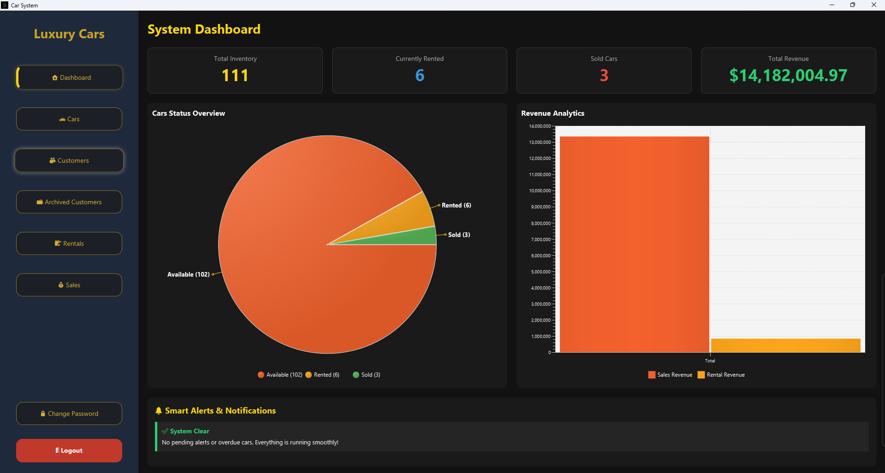
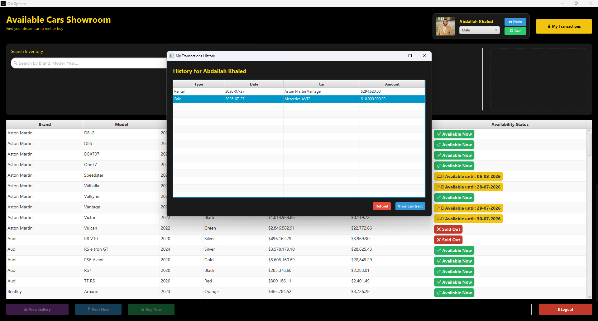
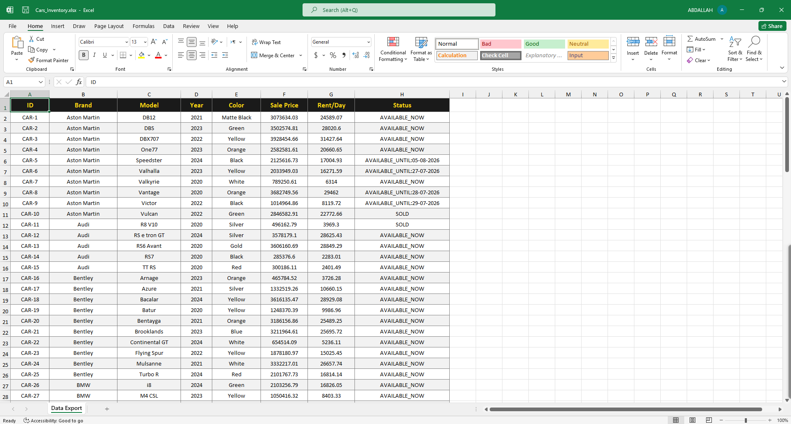
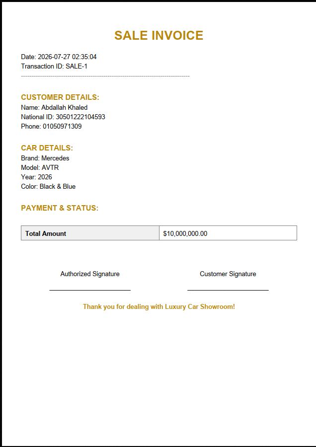
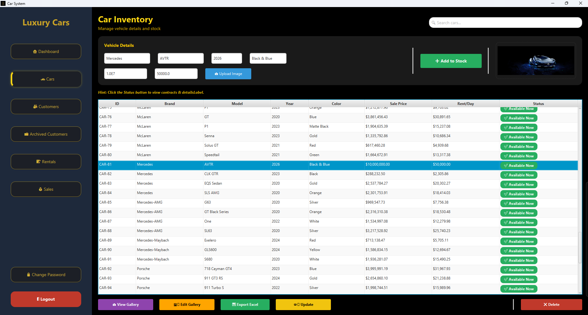

# 🚗 Car Rental and Sales System

## 📌 Project Overview
The **Car Rental and Sales System** is a comprehensive, enterprise-grade desktop application designed to streamline and automate the daily operations of car dealerships. 

Developed with **Java 23** and **JavaFX**, this system features a robust architecture consisting of approximately **12,000 lines of code** across **28 object-oriented classes**. It provides an intuitive graphical user interface (GUI) featuring a modern Dark Mode, managing inventory, processing sales, handling rentals, and tracking customer data efficiently.

## ✨ Key Features
*   **💼 Inventory & Rental Management:** Add, update, and track vehicles available for sale or rent with detailed specifications and image handling.
*   **📄 Automated PDF Invoicing:** Generates professional, ready-to-print PDF receipts and contracts for customers using the **iText** library.
*   **📊 Excel Data Export:** Seamlessly exports data tables (cars, customers, sales) into formatted `.xlsx` spreadsheets using **Apache POI** for business reporting.
*   **🔐 Multi-Role Access:** Dedicated portals for Admins and Customers with restricted access, transaction history, and smart alerts for overdue rentals.
*   **💾 Local JSON Database:** Utilizes **Gson** for lightweight, fast, and reliable local data storage.
*   **🛠️ Developer Tools (Data Seeder):** Includes a built-in data seeding utility to instantly populate the system with mock data for testing.
*   **🚀 Portable Executable:** Packaged as a standalone `.exe` application using the `jpackage` tool, requiring no prior Java installation for the end-user.

## 📸 System Previews

| System Dashboard (Analytics) | Customer Portal & History |
| :---: | :---: |
|  |  |
| **Excel Data Export** | **Automated PDF Invoice** |
|  |  |

 

  <b>Car Inventory & Stock Management</b>  
  

 

## 🛠️ Technology Stack
*   **Core Language:** Java (JDK 23)
*   **UI Framework:** JavaFX
*   **Build Tool:** Apache Maven
*   **Data Handling:** Google Gson
*   **Document Generation:** iText (PDF), Apache POI (Excel)
*   **Packaging:** jpackage (App Image)

## 🚀 How to Run
1. Navigate to the `Releases` section of this repository.
2. Download the `LuxuryCars` portable folder.
3. Run `LuxuryCars.exe` directly on any Windows machine—no setup required.

## 👨‍💻 Author
**Abdallah Khaled Mesallam**
*   Software Engineering Student
*   Connect with me on [LinkedIn](https://www.linkedin.com/in/abdallah-khaled-mesallam/)